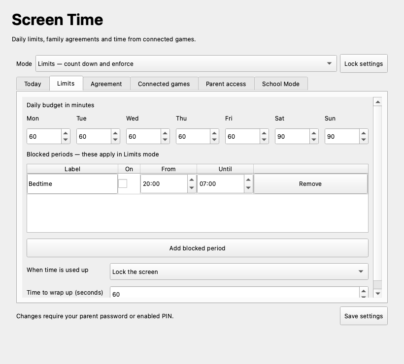
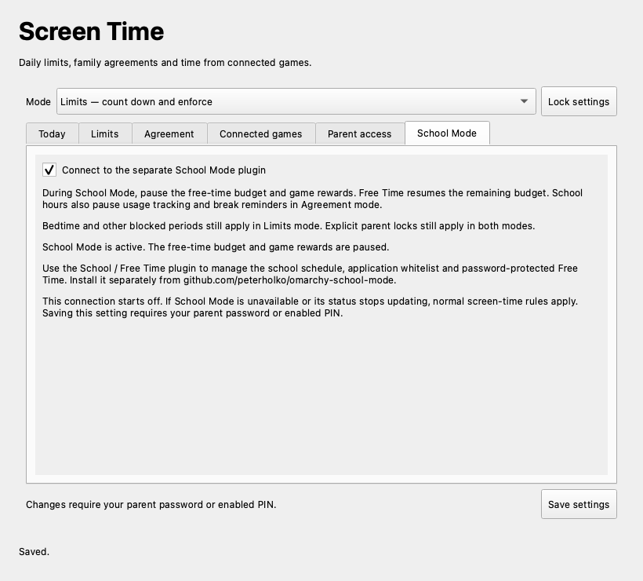

# Screen Time for Omarchy

Screen-time management with daily budgets, blocked periods, parent controls and an optional API for games to award time. The programmatic plugin ID is **`peterholko.screen-time`**. There are no built-in math questions or practice activities, and nothing opens a math exercise after login or unlock.

Screen Time can optionally connect to the separate [School / Free Time plugin](https://github.com/peterholko/omarchy-school-mode), which owns the school schedule, application whitelist and password-protected Free Time. Both plugins remain independently installable with their own parent settings panels. The connection starts disabled.



The screenshot shows the actual parent application running locally with test data. It is not a capture of a managed laptop.

## Modes and parent controls

- **Limits:** counts active, unlocked desktop time against the daily budget. Shows warnings and a countdown, then locks or notifies according to the parent's settings. Overnight blocked periods are supported.
- **Agreement:** records usage, displays a family agreement and offers gentle break reminders. It does not enforce the budget or award game credits. Changing the agreement or settings still requires a parent credential.

A parent can add or remove time, pause or resume accounting, and request a screen lock. A lock that does not take is retried; repeated failures can end the child's session. Unsaved work may be lost if the session must be ended.

Parent settings use the **existing parent password by default**: the root password established by an Omarchy child-profile installation. A standard Omarchy installation can also use the service after an administrator establishes that password. Setup checks that it exists and is not locked; it never sets or changes a password automatically. The child login password and cached sudo authorization cannot unlock these settings.

An optional 4–12 digit **parent PIN** can be enabled, changed or disabled in **Parent access**. Those changes require the current parent password or enabled PIN. The parent password remains usable. The PIN belongs only to this Screen Time plugin; it does not change the laptop's lock-screen or administrator authentication. Settings lock after five minutes without an authenticated operation.

Passwords are checked in a separate parent process. The window shows **Checking parent password…** while the check runs and disables duplicate submissions. Credentials travel on standard input, not command-line arguments, and are never part of the Quickshell plugin's state.

## Install on Omarchy

Requires Omarchy's Quickshell desktop with native plugins, Python, PySide6, jq, inotify-tools, systemd, sudo and PAM. An ISO rebuild is not needed. This installer supports Omarchy Linux; it does not install system services on macOS or Ubuntu.

Run from the child's Omarchy desktop terminal, with the parent available to authorize setup. Replace `CHILD_USERNAME` with the account to manage:

```bash
omarchy pkg add python pyside6 jq inotify-tools
omarchy plugin add https://github.com/peterholko/omarchy-screen-time-platform --enable
cd "$HOME/.config/omarchy/plugins/peterholko.screen-time"
./setup --user CHILD_USERNAME
```

Log out and back in to activate the account's new group membership. Open **Screen Time** in the bar, then **Parent controls**. The parent window is also available with:

```bash
omarchy-peterholko-screen-time parent
```

Default budgets are 60 minutes on weekdays and 90 minutes on weekends. Bedtime restrictions, game credits, the School Mode connection and the parent PIN start disabled.

**Use one screen-time enforcer per account.** Setup refuses an account already listed in the combined plugin, Omarchy Kids time module or original PR's screen-time roster. Existing installations and rosters are left untouched. To trial this plugin, use an account without another screen-time enrollment, or intentionally remove that account from the previous service first. Disabling or hiding an old bar widget does not stop its background service.

Setup installs reviewed files from this checkout under distinct `peterholko-screen-time` paths. It does not download or install other software. `OMARCHY_PATH` comes from the desktop environment and is saved for the service, including installations outside `/usr/share/omarchy`.

## Optional School Mode connection

Install and set up the original [School / Free Time plugin](https://github.com/peterholko/omarchy-school-mode#install) for the same child account. Its application whitelist, schedule, desktop restrictions and parent controls stay in that plugin. A school-only enrollment can coexist with this Screen Time service.

Open **Screen Time → Parent controls → School Mode**, enable **Connect to the separate School Mode plugin**, and save with the parent password or enabled PIN.

- While School Mode is active, the free-time budget, low-time warnings, budget countdown and game rewards pause. A used-up free-time budget does not lock the school session.
- Free Time resumes the remaining budget. Spent time, earned time, parent grants and daily game caps are retained.
- Bedtime and other blocked periods still apply in Limits mode. An explicit parent lock still applies in either mode. Agreement usage tracking and break reminders also pause during school hours.
- If School Mode is absent, unenrolled, stopped or its status is unreadable or more than 30 seconds old, normal screen-time rules apply. Turning the connection off restores normal accounting immediately, with enforcement updated on the next service tick.

The connection reads the School Mode service's root-owned status for the enrolled account. It does not trust a shell widget's claimed mode, change the application whitelist or write to School Mode's settings. Changes normally appear within one five-second accounting tick.



This screenshot shows the actual parent application with test data. School Mode retains its existing controls parent password; Screen Time uses its own parent password or optional PIN. Connecting them does not merge their credentials.

## Update

Update the plugin and explicitly update the installed background service from its checkout:

```bash
omarchy plugin update peterholko.screen-time
cd "$HOME/.config/omarchy/plugins/peterholko.screen-time"
./setup --user CHILD_USERNAME --upgrade
```

Setup keeps settings, PIN configuration and usage history. It refuses to overwrite unrelated files or locally modified installed files. Root service files are never executed directly from a child's writable plugin checkout.

## Connected games

The parent enables credits under **Connected games**, chooses an overall daily cap, and sets a reward and daily cap for each compatible game. Both the overall switch and the game's switch must be enabled. The platform chooses the credited amount; a game cannot request an arbitrary number of minutes.

[Pawberry Pet Hotel 1.6.0+](https://github.com/peterholko/omarchy-pawberry), [Number Grove 1.1.0+](https://github.com/peterholko/omarchy-number-grove) and [Paw Post Typing 1.1.0+](https://github.com/peterholko/omarchy-paw-post) support this platform from their individual repositories. Each game's service setup registers its verifier; parent opt-in is still required. The games remain playable without Screen Time. The [integration design](docs/game-integration-plan.md) records how verified completions reach the platform.

The [API guide](docs/credit-api.md) and [Python adapter](service/sdk.py) describe registration, trusted completion verification, duplicate protection and failure handling. Game credits require a current active, unlocked session in Limits mode and stop during blocked periods, a parent pause or lock request, or connected School Mode. Replaying a completion receipt cannot add time twice. A completion refused during School Mode cannot earn time by being resubmitted in Free Time; ordinary game progress is unaffected.

## Administration and troubleshooting

```bash
# Inspect this account's published status.
omarchy-peterholko-screen-time status

# Inspect the service.
sudo systemctl status peterholko-screen-time.service
sudo journalctl -u peterholko-screen-time.service -n 60

# Remove one account from this service; its history is retained.
sudo omarchy-peterholko-screen-time-admin remove CHILD_USERNAME

# Recover from a forgotten optional PIN; parent-password authentication remains.
sudo omarchy-peterholko-screen-time-admin pin-reset
```

Removing an account stops accounting for it. Hiding or disabling the plugin alone does not stop enforcement. To stop this service for every enrolled account, an administrator can run `sudo systemctl disable --now peterholko-screen-time.service`. Config and history are retained.

The parent/root password must be known only to the parent. A child with unrestricted sudo or root access can change any installed parental-control service. This plugin does not modify the child's existing administrative permissions.

## Development and verification

```bash
python3 -m unittest discover -s test -p 'test_*.py' -v
bash -n setup service/daemon.sh service/time-lib.sh
QT_QPA_PLATFORM=offscreen python3 test/parent_visual.py
```

The tests use temporary data and a fixture password verifier. They exercise the real accounting transitions, concurrent credits, replay receipts, authentication policies, installer collision checks and parent UI. No GitHub Actions workflows are included. [Verification notes](docs/verification.md) distinguish local checks from the remaining Linux desktop checks.

## Source and license

Derived from the Screen Time portion of [Jankees van Woezik's PR #11196](https://github.com/omacom/omarchy/pull/11196), pinned in [SOURCE.json](SOURCE.json). The extraction excludes the PR's preceding child-profile installation changes. Parent authentication, the standalone installer and the game-credit API are implemented here. This repository does not modify that upstream PR.

[MIT license](LICENSE), retaining the upstream notices.
